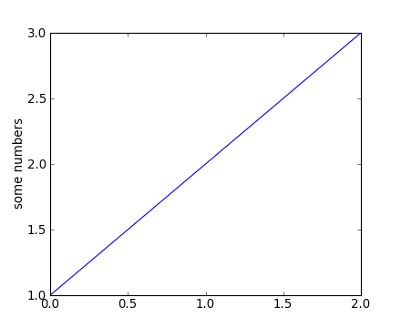
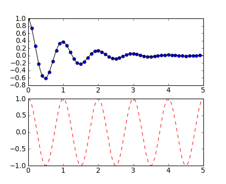

.. include:: references.rst

.. _`plot()`: http://matplotlib.sourceforge.net/api/pyplot_api.html#matplotlib.pyplot.plot
.. _`axis()`: http://matplotlib.sourceforge.net/api/pyplot_api.html#matplotlib.pyplot.axis
.. _`cla()`: http://matplotlib.sourceforge.net/api/pyplot_api.html#matplotlib.pyplot.cla
.. _`clf()`: http://matplotlib.sourceforge.net/api/pyplot_api.html#matplotlib.pyplot.clf
.. _`title()`: http://matplotlib.sourceforge.net/api/pyplot_api.html#matplotlib.pyplot.title
.. _`gca()`: http://matplotlib.sourceforge.net/api/pyplot_api.html#matplotlib.pyplot.gca
.. _`gcf()`: http://matplotlib.sourceforge.net/api/pyplot_api.html#matplotlib.pyplot.gcf
.. _`subplot()`: http://matplotlib.sourceforge.net/api/pyplot_api.html#matplotlib.pyplot.subplot
.. _`axes()`: http://matplotlib.sourceforge.net/api/pyplot_api.html#matplotlib.pyplot.axes
.. _`xlabel()`: http://matplotlib.sourceforge.net/api/pyplot_api.html#matplotlib.pyplot.xlabel
.. _`ylabel()`: http://matplotlib.sourceforge.net/api/pyplot_api.html#matplotlib.pyplot.ylabel
.. _`text()`: http://matplotlib.sourceforge.net/api/pyplot_api.html#matplotlib.pyplot.text
.. _`setp()`: http://matplotlib.sourceforge.net/api/pyplot_api.html#matplotlib.pyplot.setp
.. _`figure()`: http://matplotlib.sourceforge.net/api/pyplot_api.html#matplotlib.pyplot.figure
.. _`annotate()`: http://matplotlib.sourceforge.net/api/pyplot_api.html#matplotlib.pyplot.annotate

The ``pylab`` mode of `matplotlib`_ is a collection of command style functions
that make `matplotlib`_  work like matlab.  Each ``pylab`` function makes
some change to a figure: eg, create a figure, create a plotting area
in a figure, plot some lines in a plotting area, decorate the plot
with labels, etc....  ``Pylab`` is stateful, in that it
keeps track of the current figure and plotting area, and the plotting
functions are directed to the current axes.  On the 
`matplotlib FAQ <http://matplotlib.sourceforge.net/faq/index.html>`_ page there is a 
very good discussion on 
`Matplotlib, pylab, and pyplot: how are they related? <http://matplotlib.sourceforge.net/faq/usage_faq.html#matplotlib-pylab-and-pyplot-how-are-they-related>`_.

This tutorial has been copied and adapted from the matplotlib
`pyplot tutorial <http://matplotlib.sourceforge.net/users/pyplot_tutorial.html>`_.

To see `matplotlib`_ in action and make a simple plot do::

  clf()
  plot([1,2,3])
  ylabel('some numbers')

You may be wondering why the x-axis ranges from 0-2 and the y-axis
from 1-3.  If you provide a single list or array to the
`plot()`_ command, matplotlib assumes it is a
sequence of y values, and automatically generates the x values for
you.  Since python ranges start with 0, the default x vector has the
same length as y but starts with 0.  Hence the x data are
``[0,1,2]``.

`plot()`_ is a versatile command, and will take
an arbitrary number of arguments.  For example, to plot x versus y,
you can issue the command::

  clf()
  plot([1,2,3,4], [1,4,9,16])

For every x, y pair of arguments, there is a optional third argument
which is the format string that indicates the color and line type of
the plot.  The letters and symbols of the format string are from
matlab, and you concatenate a color string with a line style string.
The default format string is 'b-', which is a solid blue line.  For
example, to plot the above with red circles, you would issue::

  clf()
  plot([1,2,3,4], [1,4,9,16], 'ro')
  axis([0, 6, 0, 20])

.. image:: pyplots/pyplot_formatstr.png

See the `plot()`_ documentation for a complete
list of line styles and format strings.  The
`axis()`_ command in the example above takes a
list of ``[xmin, xmax, ymin, ymax]`` and specifies the viewport of the
axes.

If matplotlib were limited to working with lists, it would be fairly
useless for numeric processing.  Generally, you will use `numpy`_
arrays.  In fact, all sequences are
converted to numpy arrays internally.  The example below illustrates a
plotting several lines with different format styles in one command
using arrays.
::

  # evenly sampled time at 200ms intervals
  t = arange(0., 5., 0.2)

  # red dashes, blue squares and green triangles
  clf()
  plot(t, t, 'r--', t, t**2, 'bs', t, t**3, 'g^')

.. image:: pyplots/pyplot_three.png

**Working with multiple figures and axes**

Both Matlab and Pylab have the concept of the current
figure and the current axes.  All plotting commands apply to the
current axes.  The function `gca()`_ returns the
current axes and
`gcf()`_ returns the current figure. Normally, you don't have
to worry about this, because it is all taken care of behind the
scenes.  Below is a script to create two subplots.
::

  def f(t):
      return exp(-t) * cos(2*pi*t)

  t1 = arange(0.0, 5.0, 0.1)
  t2 = arange(0.0, 5.0, 0.02)

  figure(1)
  clf()
  subplot(2, 1, 1)  # (nrows, ncols, fignum)
  plot(t1, f(t1), 'bo', t2, f(t2), 'k')

  subplot(2, 1, 2)
  plot(t2, cos(2*pi*t2), 'r--')

The `figure()`_ command here is optional because
``figure(1)`` will be created by default, just as a ``subplot(1, 1, 1)``
will be created by default if you don't manually specify an axes.  The
`subplot()`_ command specifies ``numrows,
numcols, fignum`` where ``fignum`` ranges from 1 to
``numrows*numcols``.  The commas in the ``subplot`` command are
optional if ``numrows*numcols<10``.  You can create an arbitrary number of subplots
and axes.  If you want to place an axes manually, ie, not on a
rectangular grid, use the `axes()`_ command,
which allows you to specify the location as ``axes([left, bottom,
width, height])`` where all values are in fractional (0 to 1)
coordinates.  

You can create multiple figures by using multiple
`figure()`_ calls with an increasing figure
number.  Of course, each figure can contain as many axes and subplots
as your heart desires::

    figure(1)                # the first figure
    clf()
    subplot(2, 1, 1)         # the first subplot in the first figure
    plot([1,2,3])
    subplot(2, 1, 2)         # the second subplot in the first figure
    plot([4,5,6])

    figure(2)                # a second figure
    clf()
    plot([4,5,6])            # creates a subplot(111) by default

    figure(1)                # figure 1 current; subplot(2, 1, 2) still current
    subplot(2, 1, 1)         # make subplot(2, 1, 1) in figure1 current
    title('Easy as 1,2,3')   # subplot 2, 1, 1 title

You can clear the current figure with `clf()`_
and the current axes with `cla()`_.  If you find
this statefulness, annoying, don't despair, this is just a thin
stateful wrapper around an object oriented API, which you can use
instead  (see `artist-tutorial <http://matplotlib.sourceforge.net/users/artists.html#artist-tutorial>`_)

**Working with text**

The `text()`_ command can be used to add text in
an arbitrary location, and the `xlabel()`_,
`ylabel()`_ and `title()`_
are used to add text in the indicated locations (see `text-intro <http://matplotlib.sourceforge.net/users/text_intro.html#text-intro>`_
for a more detailed example)::

  mu, sigma = 100, 15
  x = mu + sigma * normal(size=10000)

  # the histogram of the data
  clf()
  n, bins, patches = hist(x, 50, normed=1, facecolor='g', alpha=0.75)

  xlabel('Smarts')
  ylabel('Probability')
  title('Histogram of IQ')
  text(60, .025, r'$\mu=100,\ \sigma=15$')
  axis([40, 160, 0, 0.03])
  grid(True)

.. image:: pyplots/pyplot_text.png

All of the `text()`_ commands return an
:class:`matplotlib.text.Text` instance.  Just as with with lines
above, you can customize the properties by passing keyword arguments
into the text functions or using `setp()`_::

  t = xlabel('my data', fontsize=14, color='red')

These properties are covered in more detail in `text-properties <http://matplotlib.sourceforge.net/users/text_props.html#text-properties>`.

**Using mathematical expressions in text**

matplotlib accepts TeX equation expressions in any text expression.
For example to write the expression ``\sigma_i=15`` in the title,
you can write a TeX expression surrounded by dollar signs::

    title(r'$\sigma_i=15$')

The ``r`` preceeding the title string is important -- it signifies
that the string is a *raw* string and not to treate backslashes and
python escapes.  matplotlib has a built-in TeX expression parser and
layout engine, and ships its own math fonts -- for details see
`mathtext-tutorial <http://matplotlib.sourceforge.net/users/mathtext.html#mathtext-tutorial>`_.  
Thus you can use mathematical text across platforms
without requiring a TeX installation.  For those who have LaTeX and
dvipng installed, you can also use LaTeX to format your text and
incorporate the output directly into your display figures or saved
postscript -- see `usetex-tutorial <http://matplotlib.sourceforge.net/users/usetex.html#usetex-tutorial>`_.

**Annotating text**

The uses of the basic `text()`_ command above
place text at an arbitrary position on the Axes.  A common use case of
text is to annotate some feature of the plot, and the
`annotate()`_ method provides helper
functionality to make annotations easy.  In an annotation, there are
two points to consider: the location being annotated represented by
the argument ``xy`` and the location of the text ``xytext``.  Both of
these arguments are ``(x,y)`` tuples.

.. image:: pyplots/pyplot_annotate.png

In this basic example, both the ``xy`` (arrow tip) and ``xytext``
locations (text location) are in data coordinates.
