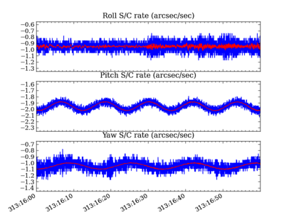

:tocdepth: 3

.. include:: references.rst

================================
Fetch Tutorial
================================

The python module ``cheta.fetch`` provides a simple interface to the
cheta archive data files.  Using the module functions it is easy to
retrieve data over a time range for a single MSID or a related set of MSIDs.
The data are return as MSID objects that contain not only the telemetry timestamps
and values but also various other data arrays and MSID metadata.

Getting started
================

From the command line start an interactive Python session::

  $ ipython --matplotlib

The basic process of fetching data always starts with importing modules into the Python
session::

  >>> from cheta import fetch_eng  # Use engineering units like degF, ft-lb-s
  >>> from cxotime import CxoTime  # Use cxotime for time conversions

In these examples we do everything with engineering units, but see the `Unit systems`_
section for how to use SI units like DegC, J-s.

Fetching and plotting full time-resolution data for a single MSID is then easy::

  >>> tephin = fetch_eng.MSID('tephin', '2009:001', '2009:007') # (MSID, start, stop)
  >>> tephin.plot()

.. plot::

    tephin = fetch_eng.MSID('tephin', '2009:001', '2009:007')
    tephin.plot()

The ``tephin`` variable returned by |fetch_MSID| is an ``MSID`` object and
we can access the various object attributes with ``<object>.<attr>``.  The
timestamps ``tephin.times`` and the telemetry values ``tephin.vals`` are both
numpy arrays.  As such you can inspect them and perform numpy operations::

    >>> print(tephin)
    <MSID TEPHIN start=2009:001:00:00:00.000 stop=2009:007:00:00:00.000 len=19869 dtype=float32 unit=DEGF>

    >>> print(tephin.times[1:5])  # CXC seconds (see Date and time formats section)
    [3.47155315e+08 3.47155348e+08 3.47155380e+08 3.47155413e+08]

    >>> print(CxoTime(tephin.times[1:5]).date)
    ['2009:001:00:00:48.564' '2009:001:00:01:21.364' '2009:001:00:01:54.164' '2009:001:00:02:26.964']

    >>> print(tephin.vals[1:5])
    [109.34415 109.34415 109.34415 109.34415]

    >>> print(tephin.vals.mean())
    107.102646

    >>> print(tephin.vals.min())
    91.63394

    >>> print(len(tephin))
    19869

You can get the time range of available data for an MSID with the
:func:`~cheta.fetch.get_time_range` function:

>>> fetch_eng.get_time_range('TEPHIN', format='date')
('1999:365:22:40:33.076', '2013:276:12:04:39.361')

This example also illustrates that the case of the MSID name is not important.

Default start and stop values
------------------------------

If you do not provide a value for the ``start`` time, then it defaults to
the beginning of the mission (1999:204 = July 23, 1999).  If you do not provide
a stop time then it defaults to the latest available data in the archive.
::

  >>> tephin = fetch_eng.Msid('tephin', stop='2001:001') # Launch through 2001:001
  >>> tephin = fetch_eng.Msid('tephin', start='2010:001') # 2010:001 through NOW
  >>> tephin = fetch_eng.Msid('tephin', '2010:001') # Same as previous
  >>> tephin = fetch_eng.Msid('tephin') # Launch through NOW

Derived parameters (calcs)
----------------------------

The cheta archive has pseudo-MSIDs that are derived via calculation from
telemetry MSIDs. These are also known as "calcs" in the context of MAUDE. In
MAUDE, a calc is indicated with a prefix of ``CALC_``, but for
compatibility with cheta a prefix of ``DP_`` is also allowed.

Derived parameter MSID names can be specified in three equivalent ways:

- ``DP_<name>>`` e.g. ``DP_PITCH_FSS``
- ``CALC_<name>`` e.g. ``CALC_PITCH_FSS``
- ``<name>`` e.g. ``PITCH_FSS``

See the :ref:`derived-parameters-or-calcs` section for more details and full
listings of available MSIDs.

Date and time formats
======================

The cheta telemetry archive tools support a wide range of formats for representing
date-time stamps.  Note that within this and other documents for this tool suite, the
words 'time' and 'date' are used interchangably to mean a date-time stamp.

The most common available formats are listed in the table below:

============ =============================================
 Format      Description
============ =============================================
  secs       Seconds since 1998-01-01T00:00:00 (TT, float)
  date       YYYY:DDD:hh:mm:ss.fff (UTC, str)
  greta      YYYYDDD.hhmmssfff (UTC, str or float)
============ =============================================

Converting between units is straightforward with the `cxotime
<https://sot.github.io/cxotime>`_ module::

  >>> from cxotime import CxoTime
  >>> datetime = CxoTime(126446464.184)
  >>> datetime.date
  '2002:003:12:00:00.000'

  >>> datetime.greta
  '2002003.120000000'

  >>> CxoTime('2009:235:12:13:14').secs
  367416860.18399996

Plotting data
=============

The `plot_cxctime()
<https://sot.github.io/ska_matplotlib/#ska_matplotlib.plot_cxctime>`_ function of the
``ska_matplotlib`` module is a handy way to make a plot of telemetry data.  This function
takes care of making nice time axis labels corresponding to the standard Year : Day of
Year format.  The function is used in the following example::

  >>> from ska_matplotlib import plot_cxctime
  >>> plot_cxctime(tephin.times, tephin.vals)

A simpler way to make the same plot is with the :func:`~cheta.fetch.MSID.plot` method,
which also labels the Y-axis, makes a title, and supports state-valued MSIDs like
``AOPCADMD``::

  >>> pcad_mode = fetch_eng.Msid('aopcadmd', '2011:185', '2011:195')
  >>> fig, ax = plt.subplots()
  >>> pcad_mode.plot(ax=ax, color="C4", lw=1)

.. plot::

    fig, ax = plt.subplots()
    pcad_mode = fetch_eng.Msid('aopcadmd', '2011:185', '2011:195')
    pcad_mode.plot(ax=ax, color="C4", lw=1)

The :func:`~cheta.fetch.MSID.plot` method accepts an ``ax`` keyword argument to specify
which plot axis to plot into. This is used to make multi-panel plots. It also
accepts any arguments work with the Matplotlib `plot()
<https://matplotlib.org/stable/api/_as_gen/matplotlib.pyplot.plot.html>`_ function.

Interactive plotting
---------------------

The :func:`~cheta.fetch.MSID.iplot` function is an easy way to quickly
explore MSID data over a wide range of time scales, from seconds to the entire
mission in a few key presses.  The function automatically fetches data from
the archive as needed.

Depending on the time scale, ``iplot`` will display either full
resolution, 5-minute, or daily values.  For 5-minute and daily values the min
and max values are also plotted.

Once the plot is displayed and the window is selected by clicking in it, the
plot limits can be controlled by the usual methods (window selection, pan /
zoom).  In addition following key commands are recognized::

  a: autoscale for full data range in x and y
  m: toggle plotting of min/max values
  p: pan at cursor x
  y: toggle autoscaling of y-axis
  z: zoom at cursor x
  ?: print help

Example::

  >>> dat = fetch_eng.Msid('aoattqt1', '2011:001', '2012:001', stat='5min')
  >>> dat.iplot()

.. Note::

   The :func:`~cheta.fetch.MSID.iplot` method is not meant for use within scripts, and
   may give unexpected results if used in combination with other plotting commands
   directed at the same plot figure.  Use the MSID :func:`~cheta.fetch.MSID.plot` method
   in this case.

Data filtering
=================

Often one needs to filter or select subsets of the raw telemetry that gets fetched from
the archive in order to use the values in analysis.  Here we describe the ways to
accomplish this in different circumstances.

.. _event_intervals:

Event interval filtering
-------------------------

The first case is when one needs to either select or remove specific intervals of
telemetry values from a full |fetch_MSID| or |fetch_MSIDset| object based on known
spacecraft events.  For instance when analyzing OBC rate noise we need to use only data
during periods of stable Kalman lock.  Likewise it is frequently useful to exclude time
intervals during which the spacecraft was in an anomalous state and OBC telemetry is
unreliable.

Using Kadi
^^^^^^^^^^^

Frequently one can handle this with the :func:`~cheta.fetch.MSID.remove_intervals`
:func:`~cheta.fetch.MSID.select_intervals` methods in conjunction with the `kadi` event
intervals mechanism.

As a simple example, the following code fetches the pitch component of the spacecraft
rate.  The samples during maneuvers are then selected and then replotted.  This
highlights the large rates during maneuvers::

  >>> aorate2 = fetch_eng.Msid('aorate2', '2011:001', '2011:002')
  >>> aorate2.plot()

  >>> from kadi import events
  >>> aorate2.select_intervals(events.manvrs)
  >>> aorate2.plot('.')

.. plot::

   from kadi import events
   aorate2 = fetch_eng.Msid('aorate2', '2011:001', '2011:002')
   aorate2.plot()
   aorate2.select_intervals(events.manvrs)
   aorate2.plot('.')

The following code illustrates use of the :func:`~cheta.fetch.MSID.remove_intervals`
method to select all all time intervals when the spacecraft is *not* maneuvering.  In this
case we include a pad time of 600 seconds before the start of a maneuver and 300 seconds
after the end of each maneuver.

  >>> aorate2 = fetch_eng.Msid('aorate2', '2011:001', '2011:002')
  >>> events.manvrs.interval_pad = (600, 300)  # Pad before, after each maneuver (seconds)
  >>> aorate2.remove_intervals(events.manvrs)
  >>> aorate2.plot('.')

.. plot::

   from kadi import events

   aorate2 = fetch_eng.Msid('aorate2', '2011:001', '2011:002')
   events.manvrs.interval_pad = (600, 300)  # Pad before, after each maneuver (seconds)
   aorate2.remove_intervals(events.manvrs)
   aorate2.plot('.')

Using logical intervals
^^^^^^^^^^^^^^^^^^^^^^^^

For cases where the intervals to be filtered cannot be expressed as `kadi` events,
the approach is to use the :func:`~cheta.utils.logical_intervals` function
located in the ``cheta.utils`` module.  This function creates an intervals
table where each row represents a desired interval and includes a ``datestart`` and
``datestop`` column.

For example to extract solar array temperatures when the off-nominal roll
angle is between 5 and 10 degrees you would do::

  >>> from cheta.utils import logical_intervals

  >>> sa_temps = fetch_eng.Msid('TSAPYT','2010:001',stat='5min')
  >>> roll = fetch_eng.Msid('ROLL','2010:001',stat='5min')

  >>> roll_off_nom = (roll.vals > 5) & (roll.vals < 10)
  >>> off_nom_intervals = logical_intervals(roll.times, roll_off_nom)

  >>> sa_temps_off_nom = sa_temps.select_intervals(off_nom_intervals, copy=True)

  >>> fig, ax = plt.subplots()
  >>> sa_temps.plot('.', color="C0")
  >>> sa_temps_off_nom.plot('.', color="C1")
  >>> ax.set_title('Solar array temps at off-nominal roll 5 - 10 degrees')

.. plot::

   from cheta.utils import logical_intervals
   sa_temps = fetch_eng.Msid('TSAPYT','2010:001',stat='5min')
   roll = fetch_eng.Msid('ROLL','2010:001',stat='5min')
   roll_off_nom = (roll.vals > 5) & (roll.vals < 10)
   off_nom_intervals = logical_intervals(roll.times, roll_off_nom)
   sa_temps_off_nom = sa_temps.select_intervals(off_nom_intervals, copy=True)

   fig, ax = plt.subplots()
   sa_temps.plot('.', color="C0")
   sa_temps_off_nom.plot('.', color="C1")
   ax.set_title('Solar array temps at off-nominal roll 5 - 10 degrees')

Notice that we created a new version of the solar array temperatures MSID object called
``sa_temps_off_nom`` (using ``copy=True``) instead of filtering in place.  Sometimes it is
convenient to have both the original and filtered data, e.g. when you want to plot both.

Note also that :func:`~cheta.fetch.MSID.remove_intervals`
:func:`~cheta.fetch.MSID.select_intervals` will accept *any* table
with columns ``datestart`` / ``datestop`` or ``tstart`` / ``tstop`` as input.

Fetching only small intervals
^^^^^^^^^^^^^^^^^^^^^^^^^^^^^^

It may be the case that you want to fetch a number of small intervals of an
MSID that is sampled at a high rate.  An example is looking at the load bus
voltage ELBV for 5 minutes after each eclipse.  Because ELBV comes down in
telemetry about 4 times per second, fetching all the values for the mission
and then selecting intervals is prohibitively expensive in memory and time.

There is a different mechanism that can work in these situations.  The ``start``
argument to a ``fetch.MSID`` or ``fetch.MSIDset`` query can be an interval
specifier.  This might be the output of :func:`~cheta.utils.logical_intervals`
or it might just be a list of ``(start, stop)`` tuples.  If that is the
case then fetch will iterate through those start / stop pairs, do the
fetch individually, and then stitch the whole thing back together into
a single fetch result.

.. Note::

   Doing lots of little fetches can be very slow due to the way that
   the raw data are stored.  There is a point at which it is faster
   to fetch the full set of values and then throw away the ones you
   don't want.  There is no hard and fast rule and you will have to
   experiment for your case.

The load bus example is a case where doing the little fetches is definitely
faster::

  >>> # Define intervals covering 5 minutes after the end of each eclipse
  >>> start, stop = '2011:001', '2014:001'  # nice Python syntax!
  >>> eclipses = events.eclipses.filter(start, stop)
  >>> post_eclipse_intervals = [(ecl.tstop, ecl.tstop + 300) for ecl in eclipses]

  >>> # Grab the load bus voltage at full resolution, post eclipse
  >>> elbv_post_eclipse = fetch_eng.Msid('elbv', post_eclipse_intervals)

  >>> # Grab the load bus voltage at 5 minute intervals over the entire time
  >>> # and chop out all samples within an hour of eclipse
  >>> elbv_5min = fetch_eng.Msid('elbv', start, stop, stat='5min')
  >>> elbv_5min.remove_intervals(events.eclipses(pad=3600))

  >>> # Plot histogram of voltages, using single sample at the 5 min midpoint (not mean)
  >>> fig, ax = plt.subplots()
  >>> ax.hist(
  ...     elbv_5min.midvals, bins=np.linspace(26, 34, 50), log=True, label="During eclipse"
  ... )

  >>> # Overplot the post-eclipse values
  >>> ax.hist(
  ...     elbv_post_eclipse.vals,
  ...     bins=np.linspace(26, 34, 50),
  ...     log=True,
  ...     facecolor="red",
  ...     alpha=0.5,
  ...     label="Post-eclipse",
  ... )

  >>> ax.legend()
  >>> ax.set_title("Load bus voltage during and post-eclipse")
  >>> ax.set_xlabel("Load bus voltage ELBV (Volts)")

.. plot::

    from kadi import events
    start, stop = '2011:001', '2014:001'
    eclipses = events.eclipses.filter(start, stop)
    post_eclipse_intervals = [(ecl.tstop, ecl.tstop + 300) for ecl in eclipses]

    elbv_post_eclipse = fetch_eng.Msid('elbv', post_eclipse_intervals)
    elbv_5min = fetch_eng.Msid('elbv', start, stop, stat='5min')
    elbv_5min.remove_intervals(events.eclipses(pad=3600))

    fig, ax = plt.subplots()
    ax.hist(
         elbv_5min.midvals, bins=np.linspace(26, 34, 50), log=True, label="During eclipse"
    )
    ax.hist(
         elbv_post_eclipse.vals,
         bins=np.linspace(26, 34, 50),
         log=True,
         facecolor="red",
         alpha=0.5,
         label="Post-eclipse",
    )
    ax.legend()
    ax.set_title("Load bus voltage during and post-eclipse")
    ax.set_xlabel("Load bus voltage ELBV (Volts)")

Bad data
-----------

For various reasons (typically a VCDU drop) the data value associated with a particular
readout may be bad.  To handle this the cheta archive provides a boolean array
called ``bads`` that is ``True`` for bad samples.  This array corresponds to the
respective ``times`` and ``vals`` arrays.  To remove the bad values one can use numpy
boolean masking::

  >>> ok = ~tephin.bads  # numpy mask requires the "good" values to be True
  >>> vals_ok = tephin.vals[ok]
  >>> times_ok = tephin.times[ok]

This is a bother to do manually so there is a built-in method that filters out
bad data points for all the MSID data arrays.  Instead just do::

  >>> tephin.filter_bad()

In fact it can be even easier if you tell fetch to filter the bad data at the point of
retrieving the data from the archive.  The following two calls both accomplish this
task, with the first one being the preferred idiom::

  >>> tephin = fetch_eng.Msid('tephin', '2009:001', '2009:007')
  >>> tephin = fetch_eng.MSID('tephin', '2009:001', '2009:007', filter_bad=True)

You might wonder why fetch ever bothers to return bad data and a bad mask, but
this will become apparent later when we start using time-correlated values instead
just simple time plots.

Really bad data
^^^^^^^^^^^^^^^^^

Even after applying ``filter_bad()`` you may run across obviously bad data in
the archive (e.g. there is a single value of AORATE1 of around 2e32
in 2007).  These are not marked with bad quality in the CXC archive and are
presumably real telemetry errors.  If you run across a bad data point you can
locate and filter it out as follows (but see also :ref:`filter_bad_times`)::

  >>> aorate1 = fetch_eng.MSID('aorate1', '2007:001', '2008:001', filter_bad=True)
  >>> bad_vals_mask = abs(aorate1.vals) > 0.01
  >>> print(aorate1.vals[bad_vals_mask])
  [-2.24164635e+32]

  >>> CxoTime(aorate1.times[bad_vals_mask]).date
  ['2007:310:22:10:02.951']

  >>> aorate1.filter_bad(bad_vals_mask)
  >>> bad_vals_mask = abs(aorate1.vals) > 0.01
  >>> print(aorate1.vals[bad_vals_mask])
  []

.. _filter_bad_times:

Filtering out arbitrary time intervals
^^^^^^^^^^^^^^^^^^^^^^^^^^^^^^^^^^^^^^^^^^

There are many periods of time where the spacecraft was in an anomalous state
and telemetry values may be unreliable without being marked as bad by CXC data
processing.  For example during safemode the OBC
values (AO*) may be meaningless.  The preferred way to handle this situation is
using :ref:`event_intervals` since those intervals are always up to date.

However, in cases where event interval filter is not applicable, an alternative mechanism
is available to remove arbitrary times of undesired data in either a
|fetch_MSID| or |fetch_MSIDset| object::

  >>> aorates = fetch_eng.MSIDset(['aorate*'], '2007:001', '2008:001')
  >>> aorates.filter_bad_times()

  >>> aorate1 = fetch_eng.MSID('aorate1', '2007:001', '2008:001')
  >>> aorates.filter_bad_times()

You can view the default bad times using:

>>> fetch_eng.msid_bad_times

If you want to remove a different interval of time known to have bad values you
can specify the start and stop time as follows:

>>> aorate1.filter_bad_times('2007:025:12:13:00', '2007:026:09:00:00')

As expected this will remove all data from the ``aorate1`` MSID between the
specified times.  Multiple bad time filters can be specified at once using the
``table`` parameter option for ``filter_bad_times``:

>>> bad_times = [
...     "2008:292:00:00:00 2008:297:00:00:00",
...     "2008:305:00:12:00 2008:305:00:12:03",
...     "2010:101:00:01:12 2010:101:00:01:25",
... ]
>>> msid.filter_bad_times(table=bad_times)

The ``table`` parameter can also be the name of a plain text file that has two
columns (separated by whitespace) containing the start and stop times::

  msid.filter_bad_times(table='msid_bad_times.dat')

Because the bad times for corrupted data don't change it doesn't always
make sense to always have to put these hard-coded times into every plotting or
analysis script.  Instead fetch also allows you to create a plain text file of
bad times in a simple format.  The file can include any number of bad time
interval specifications, one per line.  A bad time interval line has three
columns separated by whitespace, for instance::

  # Bad times file: "bad_times.dat"
  # MSID      bad_start_time  bad_stop_time
  aogbias1 2008:292:00:00:00 2008:297:00:00:00
  aogbias1 2008:227:00:00:00 2008:228:00:00:00
  aogbias1 2009:253:00:00:00 2009:254:00:00:00
  aogbias2 2008:292:00:00:00 2008:297:00:00:00
  aogbias2 2008:227:00:00:00 2008:228:00:00:00
  aogbias2 2009:253:00:00:00 2009:254:00:00:00

The MSID name is not case sensitive and the time values can be in any
``DateTime`` format.  Blank lines and any line starting with the # character
are ignored.  To read in this bad times file do::

  fetch_eng.read_bad_times('bad_times.dat')

Once you've done this you can filter out all those bad times with a single method of
the MSID object::

  aorate1.filter_bad_times()

In this case no start or stop time was supplied and the routine instead knows
to use the internal registry of bad times defined by MSID.  Finally, as if this
wasn't easy enough, there is a global list of bad times that is always read
when the fetch module is loaded.  If you come across an interval of time that
can always be filtered by all users of fetch then send an email to Tom Aldcroft
with the interval and MSID and that will be added to the global registry.
After that there will be no need to explicitly run the
``fetch.read_bad_times(filename)`` command to exclude that interval.

Copy versus in-place
^^^^^^^^^^^^^^^^^^^^^

All of the data filter methods shown here take an optional ``copy`` argument.  By default
this is set to ``False`` so that the filtering is done in-place, as shown in the previous
examples.  However, if ``copy=True`` then a new copy of the MSID object is used for the
data filtering and this copy is returned.  In both examples below the original MSID object
will be left untouched::

  >>> aorate2 = fetch_eng.Msid('aorate2', '2011:001', '2011:002')
  >>> aorate2_manvrs = aorate2.select_intervals(events.manvrs, copy=True)

Or::

  >>> aogbias1 = fetch_eng.MSID('aogbias1', '2008:291', '2008:298')
  >>> aogbias1_good = aogbias1.filter_bad(copy=True)

In addition to the ``copy`` argument in filter methods, |fetch_MSID| and |fetch_MSIDset|
objects have a ``copy()`` method to explicitly make an independent copy::

  >>> aogbias1_copy = aogbias1.copy()
  >>> np.all(aogbias1.vals == aogbias1_copy.vals)  # Are the values identical?
  True
  >>> aogbias1.vals is aogbias1_copy.vals  # Are the values arrays the same object?
  False

Five minute and daily stats
===========================

The cheta telemetry archive also hosts tables of telemetry statistics
computed over 5 minute and daily intervals.  To be more precise, the intervals
are 328 seconds (10 major frames) and 86400 seconds.  The daily intervals are
not *exactly* lined up with the midnight boundary but are within a couple of minutes.
These data are accessed by specifying
``stat=<interval>`` in the |fetch_MSID| call::

  >>> tephin_daily = fetch_eng.MSID('tephin', '2000:001', '2009:001', stat='daily')
  >>> fig, ax = plt.subplots()
  >>> plot_cxctime(tephin_daily.times, tephin_daily.mins, ax=ax)
  >>> plot_cxctime(tephin_daily.times, tephin_daily.maxes, ax=ax)
  >>> ax.set_ylabel(tephin_daily.unit)
  >>> ax.set_title(tephin_daily.MSID)

.. plot::

  tephin_daily = fetch_eng.MSID('tephin', '2000:001', '2009:001', stat='daily')
  fig, ax = plt.subplots()
  plot_cxctime(tephin_daily.times, tephin_daily.mins, ax=ax)
  plot_cxctime(tephin_daily.times, tephin_daily.maxes, ax=ax)
  ax.set_ylabel(tephin_daily.unit)
  ax.set_title(tephin_daily.MSID)

The MSID object returned for a telemetry statistics query has a number of array
attributes, depending on the statistic and the MSID data type.

==========  =====  =====  ================= ================  ===================
Name        5min   daily  Supported types   Column type       Description
==========  =====  =====  ================= ================  ===================
times         x      x    int,float,string  float             Time at midpoint
indexes       x      x    int,float,string  int               Interval index
samples       x      x    int,float,string  int32             Number of samples
midvals       x      x    int,float,string  int,float,string  Sample at midpoint
vals          x      x    int,float         int,float         Mean
mins          x      x    int,float         int,float         Minimum
maxes         x      x    int,float         int,float         Maximum
means         x      x    int,float         float             Mean
stds                 x    int,float         float             Standard deviation
p01s                 x    int,float         float             1% percentile
p05s                 x    int,float         float             5% percentile
p16s                 x    int,float         float             16% percentile
p50s                 x    int,float         float             50% percentile
p84s                 x    int,float         float             84% percentile
p95s                 x    int,float         float             95% percentile
p99s                 x    int,float         float             99% percentile
==========  =====  =====  ================= ================  ===================

As an example a daily statistics query for the PCAD mode ``AOPCADMD``
(``NPNT``, ``NMAN``, etc) yields an object with only the ``times``,
``indexes``, ``samples``, and ``vals`` arrays.  For these state MSIDs
there is no really useful meaning for the other statistics.

Telemetry statistics are a little different than the full-resolution data in
that they do not have an associated bad values mask.  Instead, if there are not
at least 3 good samples within an interval then no record for that interval
will exist.

.. _MSID-sets:

MSID sets
==========

Frequently one wants to fetch a set of MSIDs over the same time range.  This is
easily accomplished::

  >>> rates = fetch_eng.MSIDset(['aorate1', 'aorate2', 'aorate3'], '2009:001', '2009:002')

The returned ``rates`` object is like a python dictionary (hash) object with
a couple extra methods.  Indexing the object by the MSID name gives the
usual ``fetch.MSID`` object that we've been using up to this point::

  >>> plt.clf()
  >>> plot_cxctime(rates['aorate1'].times, rates['aorate1'].vals)

You might wonder what's special about an ``MSIDset``, after all the actual code
that creates an ``MSIDset`` is very simple:

>>> for msid in msids:
...     self[msid] = MSID(msid, self.tstart, self.tstop, filter_bad=False, stat=stat)

>>> if filter_bad:
...    self.filter_bad()

The answer lies in the additional methods that let you manipulate the MSIDs as a set and
enforce concordance between the MSIDs in the face of different bad values and/or
different sampling.

Say you want to calculate the spacecraft rates directly from telemetered gyro
count values instead of relying on OBC rates.  To do this you need to have
valid data for all 4 gyro channels at identical times.  In this case we know that
the gyro count MSIDs AOGYRCT<N> all come at the same rate so the only issue is with
bad values.  Taking advantage `MSID globs`_ to choose ``AOGYRCT1, 2, 3, 4`` we can write:

>>> cts = fetch_eng.MSIDset(['aogyrct?'], '2009:001', '2009:002')
>>> cts.filter_bad()

OR equivalently:

>>> cts = fetch_eng.MSIDset(['aogyrct?'], '2009:001', '2009:002', filter_bad=True)

Now we know that ``cts['aogyrct1']`` is exactly lined up with
``cts['aogyrct2']`` and so forth.  Any bad value among the 4 MSIDs will filter
out the all the values for that time stamp.  It's important to note that the
resulting data may well have time "gaps" where bad values were filtered.  In this case
the time delta between samples won't always be 0.25625 seconds.

How do you know if your favorite MSIDs are always sampled at the same rate in
the cheta archive?  Apart from certain sets of MSIDs that are obvious
(like the gyro counts), here is where things get a little complicated and a
digression is needed.

The cheta archive is derived from CXC level-0 engineering telemetry
decom.  This processing divides the all the engineering MSIDs into groups based
on subsystem (ACIS, CCDM, EPHIN, EPS, HRC, MISC, OBC, PCAD, PROP, SIM, SMS,
TEL, THM) and further divides by sampling rate (e.g. ACIS2ENG, ACIS3ENG,
ACIS4ENG).  In all there about 80 "content-types" for engineering telemetry.
All MSIDs within a content type are guaranteed to come out of CXC L0 decom with
the same time-stamps, though of course the bad value masks can be different.
Thus from the perspective of the cheta archive two MSIDs are sure to
have the same sampling (time-stamps) if and only if they have have the same CXC
content type.  In order to know whether the ``MSIDset.filter_bad()`` function
will apply a common bad values filter to a set of MSIDs you need to inspect the
content type as follows:

>>>   msids = fetch_eng.MSIDset(['aorate1', 'aorate2', 'aogyrct1', 'aogyrct2'], '2009:001', '2009:002')
...   for msid in msids.values():
...       print(msid.msid, msid.content)
...
aorate1 pcad3eng
aorate2 pcad3eng
aogyrct1 pcad15eng
aogyrct2 pcad15eng

In this case if we apply the ``filter_bad()`` method then ``aorate1`` and
``aorate2`` will be grouped separately from ``aogyrct1`` and ``aogyrct2``.  In
most cases this is probably the right thing, but there is another
hammer we can use if not.

Pretend we want to look for a correlation between gyro channel 1 rate and star centroid
rates in Y during an observation.  We get new gyro counts every 0.25625 sec and a
new centroid value every 2.05 sec.

>>> msids = fetch_eng.MSIDset(['aoacyan3', 'aogyrct1'], '2009:246:08:00:00', '2009:246:18:00:00')
>>> msids.interpolate(dt=2.05)
>>> aca_dy = msids['aoacyan3'].vals[1:] - msids['aoacyan3'].vals[:-1]
>>> aca_dt = msids['aoacyan3'].times[1:] - msids['aoacyan3'].times[:-1]
>>> aca_rate = aca_dy / aca_dt
>>> gyr_dct1 = msids['aogyrct1'].vals[1:] - msids['aogyrct1'].vals[:-1]
>>> gyr_dt = msids['aogyrct1'].times[1:] - msids['aogyrct1'].times[:-1]
>>> gyr_rate = gyr_dct1 / gyr_dt * 0.02

>>> fig, ax = plt.subplots()
>>> ax.plot(aca_rate, gyr_rate, '.')
>>> ax.set_xlabel('ACA rate (arcsec/sec)')
>>> ax.set_ylabel('Gyro rate (arcsec/sec)')
>>> ax.set_title('Gyro rate vs ACA rate')

.. plot::

  msids = fetch_eng.MSIDset(['aoacyan3', 'aogyrct1'], '2009:246:08:00:00', '2009:246:18:00:00')
  msids.interpolate(dt=2.05)
  aca_dy = msids['aoacyan3'].vals[1:] - msids['aoacyan3'].vals[:-1]
  aca_dt = msids['aoacyan3'].times[1:] - msids['aoacyan3'].times[:-1]
  aca_rate = aca_dy / aca_dt
  gyr_dct1 = msids['aogyrct1'].vals[1:] - msids['aogyrct1'].vals[:-1]
  gyr_dt = msids['aogyrct1'].times[1:] - msids['aogyrct1'].times[:-1]
  gyr_rate = gyr_dct1 / gyr_dt * 0.02

  fig, ax = plt.subplots()
  ax.plot(aca_rate, gyr_rate, '.')
  ax.set_xlabel('ACA rate (arcsec/sec)')
  ax.set_ylabel('Gyro rate (arcsec/sec)')
  ax.set_title('Gyro rate vs ACA rate')

Interpolation
--------------

The |fetch_MSIDset_interpolate| method allows for resampling all the MSIDs in a
set onto a single common time sequence.  This is done by performing
nearest-neighbor interpolation of all MSID values.  By default the update
is done in-place, but if called with ``copy=True`` then a new |fetch_MSIDset|
is returned and the original is not modified (see `Copy versus in-place`_).

Times
^^^^^^

The time sequence steps uniformly by ``dt`` seconds starting at the
``start`` time and ending at the ``stop`` time.  If not provided the
times default to the ``start`` and ``stop`` times for the MSID set.

If ``times`` is provided then this gets used instead of the default linear
progression from ``start`` and ``dt``.

For each MSID in the set the ``times`` attribute is set to the common
time sequence.  In addition a new attribute ``times0`` is defined that
stores the nearest neighbor interpolated time, providing the *original*
timestamps of each new interpolated value for that MSID.

Filtering and bad values
^^^^^^^^^^^^^^^^^^^^^^^^^

A key issue in interpolation is the handling of bad (missing) telemetry
values.  There are two parameters that control the behavior, ``filter_bad``
and ``bad_union``.

The plots and discussion below illustrate the effect of ``filter_bad`` and
``bad_union`` for a synthetic dataset consisting of two MSIDs which are sampled
at 1.025 seconds (red) and 4.1 seconds (blue).  The red values are increasing
linearly while the blue ones are decreasing linearly.  Each MSID has a single
bad point which is marked with a black cross.  The first plot below is the input
un-interpolated data:

.. image:: fetchplots/interpolate_input.png
   :width: 400 px

If ``filter_bad`` is ``True`` (which is the default) then bad values are
filtered from the interpolated MSID set.  There are two strategies for doing
this:

1) ``bad_union = False``

   Remove the bad values in each MSID *prior* to interpolating the set to a
   common time series.  Since each MSID has bad data filtered individually
   before interpolation, the subsequent nearest neighbor interpolation only
   finds "good" data and there are no gaps in the output.  This strategy is done
   when ``bad_union = False``, which is the default setting.  The results are
   shown below:

   .. image:: fetchplots/interpolate_True_False.png
      :width: 400 px

2) ``bad_union = True``

  Remove the bad values *after* interpolating the set to a common time series.
  This marks every MSID in the set as bad at the interpolated time if *any* of
  them are bad at that time.  This stricter version is required when it is
  important that the MSIDs be truly correlated in time.  For instance this is
  needed for attitude quaternions since all four values must be from the exact
  same telemetry sample.  If you are not sure, this is the safer option because
  gaps in the input data are reflected as gaps in the output.

  .. image:: fetchplots/interpolate_True_True.png
     :width: 400 px

If ``filter_bad`` is ``False`` then bad values and the associated ``bads``
attribute are left in the MSID objects of the interpolated |fetch_MSIDset|.  The
behaviors are:

1) ``bad_union = False``

   Bad values represent the bad status of each MSID individually at the
   interpolated time stamps.

   .. image:: fetchplots/interpolate_False_False.png
      :width: 400 px

2) ``bad_union = True``

   Bad values represent the union of bad status for all the MSIDs at the
   interpolated time stamps.  Notice how the ``filter_bad = True`` and
   ``bad_union = True`` case above is exactly like this one but with the
   crossed-out points removed.

   .. image:: fetchplots/interpolate_False_True.png
      :width: 400 px

Unit systems
============

Within ``fetch`` it is possible to select a different system of physical
units for the retrieved telemetry.

====== ==============================================================
System  Description
====== ==============================================================
cxc    FITS standard units used in CXC archive files (basically MKS)
sci    Same as "cxc" but with temperatures in degC instead of Kelvins
eng    OCC engineering units (TDB P009, e.g. degF, ft-lb-sec, PSI)
====== ==============================================================

The unit system is selected via the imported module as shown below::

  from cheta import fetch_cxc, fetch_eng, fetch_sci

  >>> t_cxc = fetch_cxc.MSID('tephin', '2010:001', '2010:002')
  >>> t_cxc.unit
  'K'

  >>> t_eng = fetch_eng.MSID('tephin', '2010:001', '2010:002')
  >>> t_eng.unit
  'DEGF'

  >>> t_sci = fetch_sci.MSID('tephin', '2010:001', '2010:002')
  >>> t_sci.unit
  'DEGC'

MSID globs
=============================

Each input ``msid`` for |fetch_MSID| or |fetch_MSIDset| is
case-insensitive and can include the linux file "glob" patterns "*", "?", and
"[<characters>]".  See the `fnmatch
<http://docs.python.org/library/fnmatch.html>`_ documentation for more details.

In the case of fetching a single MSID with fetch_eng.MSID, the pattern must match
exactly one MSID.  The following are valid examples of the input MSID glob and
the matched MSID::

    "orb*1*_x": ORBITEPHEM1_X
    "*pcadmd": AOPCADMD

The real power of globbing is for |fetch_MSIDset| where you can easily
choose a few related MSIDs::

    "orb*1*_?": ORBITEPHEM1_X, Y and Z
    "orb*1*_[xyz]": ORBITEPHEM1_X, Y and Z
    "aoattqt[123]": AOATTQT1, 2, and 3
    "aoattqt*": AOATTQT1, 2, 3, and 4

    dat = fetch_eng.MSIDset(['orb*1*_[xyz]', 'aoattqt*'], ...)

The :func:`~cheta.fetch.msid_glob()` method will show you exactly what
matches a given ``msid``::

    >>> fetch_eng.msid_glob('orb*1*_?')
    (['orbitephem1_x', 'orbitephem1_y', 'orbitephem1_z'],
     ['ORBITEPHEM1_X', 'ORBITEPHEM1_Y', 'ORBITEPHEM1_Z'])

    >>> fetch_eng.msid_glob('dpa_power')
    (['dpa_power'], ['DP_DPA_POWER'])

If the MSID glob matches more than 10 MSIDs then an exception is raised to
prevent accidentally trying to fetch too many MSIDs (e.g. if you provided "AO*"
as an input).  This limit can be changed by setting the ``MAX_GLOB_MATCHES``
module attribute::

    fetch_eng.MAX_GLOB_MATCHES = 20

Finally, for derived parameters the initial ``DP_`` is optional::

    "dpa_pow*": DP_DPA_POWER
    "roll": DP_ROLL

State-valued MSIDs
==================

MSIDs that are state-valued such as ``AOPCADMD`` or ``AOECLIPS`` have the full
state code values stored in the ``vals`` attribute.  The raw count values can
be accessed with the ``raw_vals`` attribute::

  >>> dat = fetch_eng.Msid('aopcadmd', '2011:185', '2011:195', stat='daily')
  >>> dat.vals
  array(['NMAN', 'NMAN', 'STBY', 'STBY', 'STBY', 'NSUN', 'NPNT', 'NPNT',
  'NPNT', 'NPNT'],
  dtype='|S4')
  >>> dat.raw_vals
  array([2, 2, 0, 0, 0, 3, 1, 1, 1, 1], dtype=int8)

This is handy for plotting or other analysis that benefits from a numeric
representation of the values.  The mapping of raw values to state code is available
in the ``state_codes`` attribute::

  >>> dat.state_codes
  [(0, 'STBY'),
   (1, 'NPNT'),
   (2, 'NMAN'),
   (3, 'NSUN'),
   (4, 'PWRF'),
   (5, 'RMAN'),
   (6, 'NULL')]

State value counts
------------------

For state-valued MSIDs, the 5-minute and daily statistics include attributes that provide
the count of samples within the interval for each possible state.  The attribute will be
named ``n_<STATE>s``, for instance ``n_NMANs`` for ``AOPCADMD``.

These counts are useful in at least a couple of different ways.  First, one can determine
the duty cycle for an ON/OFF bi-level for mission trending::

  >>> dat = fetch_eng.Msid('4ohtrz10', '2000:001', '2000:010', stat='daily')
  >>> dat.n_ONs
  array([3674, 3626, 3624, 3615, 3599, 3686, 3654, 3640], dtype=int32)
  >>> dat.n_OFFs
  array([6852, 6910, 6913, 6922, 6937, 6850, 6881, 6895], dtype=int32)
  >>> dat.n_ONs * 1.0 / dat.samples
  array([ 0.34975323,  0.34925005,  0.34415338,  0.34393091,  0.34307678,
          0.34159074,  0.34984814,  0.34684385,  0.34551495])

  >>> dat = fetch_eng.Msid('4ohtrz10', '2000:001', '2017:001', stat='daily')
  >>> duty_cycle = dat.n_ONs * 1.0 / dat.samples
  >>> plot_cxctime(dat.times, duty_cycle)
  >>> plt.title('ON duty cycle for 4OHTRZ10')

.. plot::

   dat = fetch_eng.Msid('4ohtrz10', '2000:001', '2017:001', stat='daily')
   duty_cycle = dat.n_ONs * 1.0 / dat.samples
   plot_cxctime(dat.times, duty_cycle)
   plt.title('ON duty cycle for 4OHTRZ10')

Second, one can use the state counts to very quickly look for rare occurrences of an MSID
in a particular state.  As an example we can easily find every time that PCAD reported
being in bright star hold (``AOACASEQ == 'BRIT'``).  This could occur due to an
autonomous safing action or as part of a realtime recovery activity.  In any case
searching the full-resolution telemetry is slow and memory intensive, but doing this
via the daily state code counts is a snap::

  >>> dat = fetch_eng.Msid('aoacaseq', '2000:001', stat='daily')
  >>> ok = dat.n_BRITs > 10  # Require at least 10 BRIT samples
  >>> print([d[:8] for d in DateTime(dat.times[ok]).date])
  ['2000:049', '2001:111', '2001:112', '2001:265', '2002:024', '2003:200', '2004:200',
   '2004:208', '2004:213', '2004:315', '2004:316', '2008:225', '2008:226', '2008:227',
   '2008:294', '2010:151', '2011:190', '2011:192', '2011:299', '2011:300', '2012:151',
   '2014:207', '2015:007', '2015:264', '2015:265', '2016:064', '2016:234', '2016:324',
   '2016:325']

One could then drill down on these dates using 5-minute or full-resolution telemetry.

Telemetry database (TDB)
========================

With an |fetch_MSID| object you can directly access all the information
in the Chandra Telemetry Database (TDB) which relates to that MSID.  This is
done through the
`ska_tdb <https://sot.github.io/ska_tdb>`_ module.  For example::

  >>> dat = fetch_eng.Msid('aopcadmd', '2011:187', '2011:190')

  >>> dat.tdb  # Top level summary of TDB info for AOPCADMD
  <MsidView msid="AOPCADMD" technical_name="PCAD MODE">

  >>> dat.tdb.Tsc  # full state codes table
  rec.array([('AOPCADMD', 1, 1, 0, 0, 'STBY'), ('AOPCADMD', 1, 7, 6, 6, 'NULL'),
             ('AOPCADMD', 1, 6, 5, 5, 'RMAN'), ('AOPCADMD', 1, 5, 4, 4, 'PWRF'),
             ('AOPCADMD', 1, 4, 3, 3, 'NSUN'), ('AOPCADMD', 1, 2, 1, 1, 'NPNT'),
             ('AOPCADMD', 1, 3, 2, 2, 'NMAN')],
            dtype=[('MSID', '|S15'), ('CALIBRATION_SET_NUM', '<i8'),
                   ('SEQUENCE_NUM', '<i8'), ('LOW_RAW_COUNT', '<i8'),
                   ('HIGH_RAW_COUNT', '<i8'), ('STATE_CODE', '|S4')])

  >>> dat.tdb.Tsc['STATE_CODE']  # STATE_CODE column
  rec.array(['STBY', 'NULL', 'RMAN', 'PWRF', 'NSUN', 'NPNT', 'NMAN'],
            dtype='|S4')

  >>> dat.tdb.technical_name
  'PCAD MODE'

  >>> dat.tdb.description
  'LR/15/SD/10 PCAD_MODE'

Note that the ``tdb`` attribute is equivalent to ``ska_tdb.msids[MSID]``, so refer to
the `ska_tdb <https://sot.github.io/ska_tdb>`_ documentation for further information.

MAUDE telemetry server
======================

The ``fetch`` module provides the capability to choose the source of telemetry data used
in queries.  The historical (and current default) source of telemetry data consists of a
collection of HDF5 files that are constructed and updated daily using CXC level-0
engineering telemetry decom products.  This has the bulk of commonly used telemetry but
typically has a latency of 2-3 days.

In order to fill this gap an interface to the `MAUDE telemetry server
<http://occweb.cfa.harvard.edu/twiki/Software/MaudeSupport>`_ is also available.

The key differences between the CXC and MAUDE telemetry data sources are:

- CXC includes :ref:`pseudo-msids` such as ephemeris data, ACIS and HRC
  housekeeping, and derived parameters like the pitch and off-nominal roll angle.
- CXC has a latency of 2-3 days vs. hours for MAUDE back-orbit telemetry.
- During a realtime support MAUDE provides real-time telemetry.
- CXC has about 6800 MSIDs while MAUDE has around 11350.  At least some of the MSIDs that
  are only in MAUDE are somewhat obscure ones like ``ACIMG1D1`` (PEA1 PIXEL D1 DATA IMAGE
  1) which the CXC decoms into higher-level products.
- CXC is optimized for large bulk queries using direct disk access.  It is limited only by
  system memory (gigabytes) and **always returns all available data points**.
- MAUDE is optimized for smaller, more frequent queries and uses a secure web server to
  provide data.  It has limits on both the number of returned data values (around 100k)
  and the total number of bytes in the data (around 1.6 Mb).
- By default MAUDE will sub-sample the data as necessary to fit in the data limits
  (see below for example of disabling this feature).

Basic usage
-----------

Once you have followed the steps to `Setup for MAUDE authentication
<https://sot.github.io/maude/#setup-for-authentication>`_, you can access the MAUDE
data.

The source of data for fetch queries is controlled by the module-level ``fetch.data_source``
configuration object.  You can first view the current data source with::

  >>> fetch_eng.data_source.sources()
  ('cxc',)

This shows that the current source of data is the CXC files.  You can change to MAUDE as follows::

  >>> fetch_eng.data_source.set('maude')
  >>> fetch_eng.data_source.sources()
  ('maude',)

Now if you execute a query MAUDE will be used.  There is not any obvious difference from
the user perspective and the returned ``Msid`` object looks and behaves exactly as if you
had queried from the CXC data::

  >>> dat = fetch_eng.Msid('tephin', '2015:001', '2015:002')

The most direct way to be sure of the actual data source is to look at the ``data_source``
attribute::

  >>> dat.data_source
  {'maude': {'flags': {'subset': False, 'tolerance': False},
             'start': '2015:001:12:00:15.037',
             'stop': '2015:002:11:59:37.452'}}

This shows the ``start`` and ``stop`` time for data values that were returned
by the MAUDE server.  In addition two status flags are returned.

**Data subsets**

For the purposes here, the important flag is ``subset``.  As mentioned above, the MAUDE
server will not return more than around 100k data values in a single query.  When a query
would return more than this number of values then the server automatically subsamples the
data to return no more than 100k points.  This is done in a clever way such that it
reproduces what a plot of the fully-sampled dataset would look like at screen resolution.
Nevertheless one should pay attention to the ``subset`` flag, particularly in cases where
subsampling could affect analysis results.  One example is examinine attitude quaternions
(``AOATTQT{1,2,3,4}``) where the four values must be taken from the exact same readout
frame.

In order to force the MAUDE server to return full resolution data, the MAUDE data source
needs to be configured with the ``allow_subset=False`` flag.  This will prevent
sub-sampling by doing multiple small queries.  This has an overhead penalty because it may
require multiple server requests to piece together the full query.  For example::

  >>> import maude
  >>> maude.set_logger_level(10)  # Show debugging information from maude
  >>> fetch_eng.data_source.set('maude allow_subset=False')
  >>> dat = fetch_eng.Msid('aoattqt1', '2016:001', '2016:003')
  get_msids: Using .netrc with user=taldcroft
  get_msids_in_chunks: Chunked reading: max samples / major_frame = 32, chunk dt = 82000.0 secs
  get_msids: Getting URL http://t...cfa.harvard.edu/...&ts=2016001120000000&tp=2016002040000000
  get_msids: Getting URL http://t...cfa.harvard.edu/...&ts=2016002040000000&tp=2016002200000000
  get_msids: Getting URL http://t...cfa.harvard.edu/...&ts=2016002200000000&tp=2016003120000000
  >>> len(dat.vals)
  168586  # MORE than 100000!

When ``allow_subset=False`` then a fetch query is not allowed to span more than 7 days in
order to prevent swamping the MAUDE server.

**Multiple data sources**

A common use case (indeed a key driver for accessing MAUDE through the Ska interface) is
to fetch data using *both* the CXC and MAUDE data, taking CXC data where possible and then
filling in the last couple of days using MAUDE with full-resolution data (no subsetting).
This is done by specifying the data source as both ``cxc`` and ``maude
allow_subset=False``, as shown in the following example::

  >>> fetch_eng.data_source.set('cxc', 'maude allow_subset=False')

Now assume the current date is 2016:152:01:00:00 and we want all available data since 2016:100

  >>> dat = fetch_eng.Msid('tephin', '2016:100')
  >>> dat.data_source
  {'cxc': {'start': '2016:100:12:00:11.268',
           'stop': '2016:150:19:38:40.317'},
   'maude': {'flags': {'subset': False, 'tolerance': False},
             'start': '2016:150:19:38:56.130',
             'stop': '2016:151:20:40:37.392'}}

This shows that data have been fetched from both data sources and stitched together
seamlessly.

Context manager
---------------

The ``fetch.data_source`` object can also be used as a context manager to *temporarily*
change the data source within an enclosed code block.  This is useful because it restores
the original data source even if there is an exception within the code block.  For
instance::

  >>> fetch_eng.data_source.sources()
  ('cxc',)
  >>> with fetch_eng.data_source('maude'):
  ...     dat = fetch_eng.Msid('tephin', '2016:001', '2016:002')
  ...     print(fetch.data_source.sources())
  ...
  ('maude',)
  >>> fetch_eng.data_source.sources()
  ('cxc',)

Data source differences
-----------------------

There are different MSIDs available in the different data sources (but *mostly* they
overlap).  To directly understand this you can access the MSID lists as follows.  The
``get_msids()`` method of ``data_source`` returns a Python ``set`` of MSIDs::

  >>> cxc_msids = fetch_eng.data_source.get_msids('cxc')
  >>> maude_msids = fetch_eng.data_source.get_msids('maude')
  >>> sorted(cxc_msids - maude_msids)  # In CXC but not MAUDE
  ['3W00FILL',
   '3W05FILL',
   '3W22FILL',
   ...
   'TMP_FEP1_MONG',
   'TMP_FEP1_PCB',
   'TMP_FEP1_RAM']

  >>> len(cxc_msids - maude_msids)
  552
  >>> len(maude_msids - cxc_msids)
  5107

If you do a mixed-source query (CXC and MAUDE) for an MSID that is available in
only one of the sources, then just the one source will be used.  For instance::

  >>> dat = fetch_eng.Msid('pitch', '2016:145')  # from 2016:145 to present
  >>> dat.data_source
  {'cxc': {'start': '2016:145:12:00:00.241',
           'stop': '2016:150:18:37:01.841'}}

Pushing it to the limit
========================

The cheta telemetry archive is designed to help answer questions that
require big datasets.  Let's explore what is possible.  First quit from your
current ``ipython`` session with ``exit()``.  Then start a window that will let
you watch memory usage::

  xterm -geometry 80x15 -e 'top -u <username>' &

This brings up a text-based process monitor.  Focus on that window and hit "M"
to tell it to order by memory usage.  Now go back to your main window and get
all the ``TEIO`` data for the mission::

  ipython --matplotlib
  import cheta.fetch as fetch
  import matplotlib.pyplot as plt
  from ska_matplotlib import plot_cxctime
  time teio = fetch_eng.MSID('teio', '2000:001', '2010:001', filter_bad=True)
  Out[]: CPU times: user 2.08 s, sys: 0.49 s, total: 2.57 s
         Wall time: 2.85 s

Now look at the memory usage and see that around a 1 Gb is being used::

  len(teio.vals) / 1e6
  plt.clf()
  plot_cxctime(teio.times, teio.vals, '.', markersize=0.5)

Making a plot with 13 million points takes 5 to 10 seconds and some memory.
See what happens to memory when you clear the plot::

  plt.clf()

Now let's get serious and fetch all the AORATE3 values (1 per second) for the mission after deleting the TEIO data::

    del teio
    %time aorate3 = fetch_eng.MSID('aorate3', '2000:001', '2010:001', filter_bad=True)
    Out[]: CPU times: user 38.83 s, sys: 7.43 s, total: 46.26 s
           Wall time: 60.10 s

We just fetched 300 million floats and now ``top`` should be showing some respectable memory usage::

  Cpu(s):  0.0%us,  0.1%sy,  0.0%ni, 99.7%id,  0.2%wa,  0.1%hi,  0.0%si,  0.0%st

    PID USER      PR  NI  VIRT  RES  SHR S %CPU %MEM    TIME+  COMMAND
  14243 aca       15   0 6866m 6.4g  11m S  0.0 40.9   3:08.70 ipython

If you try to make a simple scatter plot with 300 million points you will
make the machine very unhappy.  But we can do computations or make a histogram of
the distribution::

  plt.clf()
  plt.hist(np.log10(abs(aorate3.vals)+1e-15), log=True, bins=100)

.. image:: fetchplots/aorate3_hist.png

Rules of thumb:

* 1 million is fast for plotting and analysis.
* 10 million is fast for analysis but on the edge for plotting:

  * Plotting lines or symbols (the ``'-'`` or ``'.'`` markers) may fail with the dreaded ``Agg
    rendering complexity exceeded``.  Once this happens you frequently need to restart
    IPython entirely to make more plots.
  * Plotting with the ``','`` marker is typically OK as this just makes a single pixel
    dot instead of a plot glyph.

* 300 million is OK for analysis, expect 30-60 seconds for any operation.  Plots can only
  be done using density image maps binning in 2-d.
* Look before you leap, do smaller fetches first and check sizes as shown below.
* 5-minute stats are ~10 million so you are always OK.

Estimating fetch size
-----------------------

You can do a better than the above rules of thumb using the
:func:`~cheta.utils.get_fetch_size` function in the ``cheta.utils``
module to estimate the size of a fetch request prior to making the call.  This is
especially useful for applications that want to avoid unreasonably large data requests.

As an example, compute the estimated size in Megabytes for fetching full-resolution data
for TEPHIN and AOPCADMD for a period of 3 years, both of which are then interpolated at a
time sampling of 32.8 seconds::

  >>> from cheta.utils import get_fetch_size
  >>> get_fetch_size(['TEPHIN', 'AOPCADMD'], '2011:001', '2014:001', interpolate_dt=32.8)
  (1248.19, 75.06)

This returns two numbers: the first is the memory (megabytes) for the internal fetch
operation to get the telemetry data, and the second is the memory for the interpolated
output.  This estimate is made by fetching a 3-day sample of data starting at 2010:001
and extrapolating.  Therefore the size estimates are reflective of normal operations.

Putting it all together
=======================

As a final example here is a real-world problem of wanting to compare OBC
rates to those derived on the ground using raw gyro data.
::

  import matplotlib.pyplot as plt
  from cheta import fetch
  from ska_matplotlib import plot_cxctime
  import ska_numpy

  tstart = '2009:313:16:00:00'
  tstop = '2009:313:17:00:00'

  # Get OBC rates and gyro counts
  obc = fetch_eng.MSIDset(['aorate1', 'aorate2', 'aorate3'], tstart, tstop, filter_bad=True)
  gyr = fetch_eng.MSIDset(['aogyrct1', 'aogyrct2', 'aogyrct3', 'aogyrct4'], tstart, tstop, filter_bad=True)

  # Transform delta gyro counts (4 channels) to a body rate (3 axes)
  cts2rate = array([[-0.5       ,  0.5       ,  0.5       , -0.5       ],
                    [-0.25623091,  0.60975037, -0.25623091,  0.60975037],
                    [-0.55615682, -0.05620959, -0.55615682, -0.05620959]])

  # Calculate raw spacecraft rate directly from gyro data
  cts = np.array([gyr['aogyrct1'].vals,
                  gyr['aogyrct2'].vals,
                  gyr['aogyrct3'].vals,
                  gyr['aogyrct4'].vals])
  raw_times = (gyr['aogyrct1'].times[1:] + gyr['aogyrct1'].times[:-1]) / 2
  delta_times = gyr['aogyrct1'].times[1:] - gyr['aogyrct1'].times[:-1]
  delta_cts = cts[:, 1:] - cts[:, :-1]
  raw_rates = np.dot(cts2rate, delta_cts) * 0.02 / delta_times

  # Plot the OBC rates
  plt.figure(1, figsize=(8,6))
  plt.clf()
  for frame, msid, label in ((1, 'aorate1', 'roll'),
                             (2, 'aorate2', 'pitch'),
                             (3, 'aorate3', 'yaw')):
      subplot(3, 1, frame)
      obc_rates = obc[msid].vals * 206254.
      plot_cxctime(obc[msid].times, obc_rates, '-')
      plot_cxctime(obc[msid].times, ska_numpy.smooth(obc_rates, window_len=20), '-r')
      ylim(average(obc_rates) + array([-1.5, 1.5]))
      title(label.capitalize() + ' rate (arcsec/sec)')

  plt.subplots_adjust(bottom=0.12, top=0.90)
  # plt.savefig('obc_rates.png')

  # Plot the S/C rates from raw gyro data
  plt.figure(2, figsize=(8,6))
  plt.clf()
  for axis, label in ((0, 'roll'),
                      (1, 'pitch'),
                      (2, 'yaw')):
      subplot(3, 1, 1+axis)
      raw_rate = raw_rates[axis, :]
      plot_cxctime(raw_times, raw_rate, '-')
      plot_cxctime(raw_times, ska_numpy.smooth(raw_rate, window_len=20), '-r')
      ylim(np.mean(raw_rate) + np.array([-0.4, 0.4]))
      title(label.capitalize() + ' S/C rate (arcsec/sec)')

  plt.subplots_adjust(bottom=0.12, top=0.90)
  # plt.savefig('gyro_sc_rates.png')

.. comment: TODO: Add plot directive

.. image:: fetchplots/obc_rates.png

Remote data access
==================

The telemetry archive can be accessed remotely if ssh access to
``chimchim`` is available.  The user will be queried for ssh credentials and
``fetch`` will connect with a controller running on ``chimchim`` to retrieve the
data.  Besides the initial query for credentials (and slower speeds when fetching data over
the network), the use of ``fetch`` is essentially the same whether the archive is
local or remote.

In order to use this option, the user must have a special key file
``ska_remote_access.json`` placed at the root of the local Python installation
folder.  This is placed in the directory shown with ``import sys;
print(sys.prefix)``.

To get a copy of this file contact Mark Baski or Tom Aldcroft, or look in the
``DAWG_TIPS_AND_TRICKS`` topic in the ``SpecialProjects`` Web on the TWiki.

Remote access is controlled as follows:

- The environment variable ``SKA_ACCESS_REMOTELY`` can be set to "False" or "True"
  to force either disabling or enabling remote access, respectively.
- If ``SKA_ACCESS_REMOTELY`` is not defined on a linux or Mac system, remote access
  is always *disabled*.
- If ``SKA_ACCESS_REMOTELY`` is not defined on a Windows system, remote access
  is *enabled* unless the system finds a local cheta data archive.  It looks
  for data in either ``$SKA/data/eng_archive`` or ``$ENG_ARCHIVE``, where those
  refer to user-defined environment variables.
- If remote access is disabled and there is no local cheta data archive,
  then a warning is issued. In this case you can still use MAUDE for data access
  with ``fetch.data_source.set('maude')``.

Scripts using remote access
---------------------------

If you are using remote data access from within a script, you should write the
script using calls to functions instead of having everything at the main level.
For example::

    from cheta import fetch

    def main():
        # For remote access this will interactively prompt the user for an
        # IP address, user name and password (for only the first fetch).
        dat = fetch_eng.Msid('tephin', '2020:001', '2020:002')

        # Now do something with dat
        print(dat)

    if __name__ == '__main__':
        main()

The reason for this is that the code which accesses the remote server may end
up importing the main script many times, so if you have non-trivial code at the
top level this causes problems. For example::

    # DO NOT DO THIS
    from cheta import fetch_eng

    # This line gets run multiple times in succession via multiprocessing: FAIL
    dat = fetch_eng.Msid('tephin', '2020:001', '2020:002')

These problems are known to happen on Windows, but following this best practice
should be done for all remote-access scripts.

Local cheta archive
===================

Instructions for creating, using, and maintaining a local cheta archive (on your
laptop for instance) are found at the `Tutorial for installing and maintaining a
cheta telemetry archive
<https://github.com/sot/cheta/wiki/Tutorial:-install-and-maintain-cheta-telemetry-archive>`_.

Archived topics
===============

This section contains a list of topics that have been archived from the main tutorial
These topics are still relevant but are not as commonly used as the main topics.

.. toctree::
   :maxdepth: 1

   archived_topics
